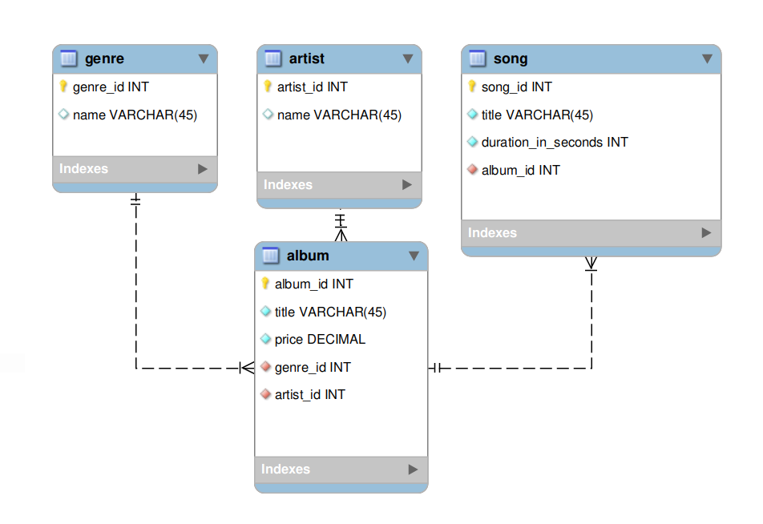

# Atividades

1. Caso não tenha feito ainda, refaça o banco de dados **albuns** por conta própria, como está descrito na seção **"Hora de mexer os dedos"**.



```sql
CREATE DATABASE IF NOT EXISTS albums;
USE albums;

CREATE TABLE genre (
  genre_id INT NOT NULL PRIMARY KEY AUTO_INCREMENT,
  name VARCHAR(50) NOT NULL
);

CREATE TABLE artist (
  artist_id INT NOT NULL PRIMARY KEY AUTO_INCREMENT,
  name VARCHAR(50) NOT NULL
);

CREATE TABLE album (
  album_id INT NOT NULL PRIMARY KEY AUTO_INCREMENT,
  title VARCHAR(50) NOT NULL,
  price DECIMAL NOT NULL,
  genre_id INT NOT NULL,
  artist_id INT NOT NULL,
  FOREIGN KEY (genre_id) REFERENCES genre(genre_id),
  FOREIGN KEY (artist_id) REFERENCES artist(artist_id)
);

CREATE TABLE song (
  song_id INT NOT NULL PRIMARY KEY AUTO_INCREMENT,
  title VARCHAR(50),
  duration_in_seconds INT NOT NULL,
  album_id INT NOT NULL,
  FOREIGN KEY (album_id) REFERENCES album(album_id)
);
```

2. Faça [este quiz](https://www.sanfoundry.com/sql-mcqs-mysql-datatypes-1/) sobre tipos de dados no MySQL.

3. Faça [este quiz](https://www.sanfoundry.com/sql-mcqs-mysql-datatypes-2/) sobre como escolher tipos de dados no MySQL.

4. Um zoológico precisa de um banco de dados para armazenar informações sobre os seus animais. As informações a serem armazenadas sobre cada animal são:

* Nome;
* Espécie;
* Sexo;
* Idade;
* Localização. Cada animal também possui **um** cuidador, e cada cuidador pode ser responsável por mais de um animal. Além disso, cada cuidador possui **um** gerente, sendo que cada gerente pode ser responsável por mais de um cuidador. Siga os passos aprendidos no dia de hoje para modelar essa base de dados.
