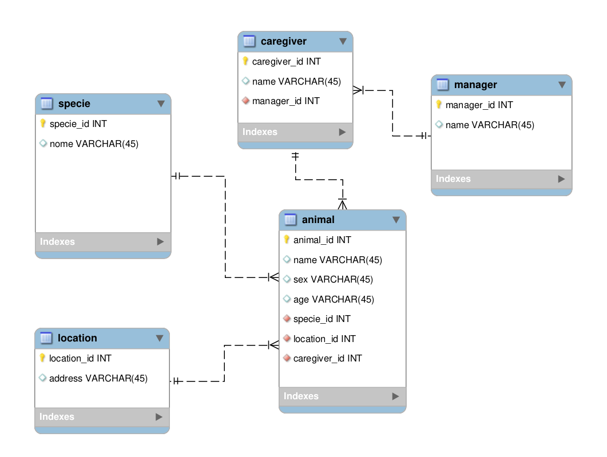

# Atividades

1. Caso não tenha feito ainda, refaça o banco de dados **albuns** por conta própria, como está descrito na seção **"Hora de mexer os dedos"**.


```sql
CREATE DATABASE IF NOT EXISTS albums;
USE albums;

CREATE TABLE genre (
  genre_id INT NOT NULL PRIMARY KEY AUTO_INCREMENT,
  name VARCHAR(50) NOT NULL
);

CREATE TABLE artist (
  artist_id INT NOT NULL PRIMARY KEY AUTO_INCREMENT,
  name VARCHAR(50) NOT NULL
);

CREATE TABLE album (
  album_id INT NOT NULL PRIMARY KEY AUTO_INCREMENT,
  title VARCHAR(50) NOT NULL,
  price DECIMAL NOT NULL,
  genre_id INT NOT NULL,
  artist_id INT NOT NULL,
  FOREIGN KEY (genre_id) REFERENCES genre(genre_id),
  FOREIGN KEY (artist_id) REFERENCES artist(artist_id)
);

CREATE TABLE song (
  song_id INT NOT NULL PRIMARY KEY AUTO_INCREMENT,
  title VARCHAR(50),
  duration_in_seconds INT NOT NULL,
  album_id INT NOT NULL,
  FOREIGN KEY (album_id) REFERENCES album(album_id)
);
```

2. Faça [este quiz](https://www.sanfoundry.com/sql-mcqs-mysql-datatypes-1/) sobre tipos de dados no MySQL.

```
1. Character data can be stored as ______________
A: c) Either Fixed or Variable length string

2. Which declaration represents that “character data will consume the same number of bytes as declared and is right padded”?
A: a) Char

3. Which declaration doesn’t use the same number of bytes and consumption of bytes depends on the input data?
A: a) Varchar

4. The maximum length of the char columns is ____________
A: a) 255 bytes

5. The maximum length of the varchar columns is ____________
A: a) Upto 65,535 bytes

6. In oracle database variable length column is declared by ____________
A: c) Varchar2

7. Mysql support different character sets, which command is used to display all character sets?
A: a) SHOW CHARACTER SET;

8. Which one is the correct declaration for choosing the character set other than default?
A: a) Varchar(20) character set utf8;

9. Which “text type” has the maximum number of bytes?
A: d) Long text

10. Which among the following have the maximum bytes?
A: c) Text type
```

3. Faça [este quiz](https://www.sanfoundry.com/sql-mcqs-mysql-datatypes-2/) sobre como escolher tipos de dados no MySQL.

```
1. What will happen if the data being loaded into a text column exceeds the maximum size of that type?
A: c) Data will be truncated

2. Which data type is more suitable for storing “small notes” in Mysql?
A: c) Mediumtext

3. Which data type is more suitable for storing “documents” in Mysql?
A: b) Longtext

4. “Numeric Data” is used to store ____________
A: d) Both Whole and Natural numbers

5. Which Numeric Data type has the largest range?
A: c) Int

6. What will be the storage pattern for “float(4,2)” in Mysql?
A: a) Total of four digits, two to the left of decimal and two to the right of decimal

7. Which among the following are the correct representation of “float(4,2)”?
A: d) Both 24.33 and 124.4

8. Which among the following is the correct representation of “float(5,0)”?
A: c) 12345

9. Which among the following is the correct representation of “float(1,1)”?
A: a) Total of 1 digit
```

4. Um zoológico precisa de um banco de dados para armazenar informações sobre os seus animais. As informações a serem armazenadas sobre cada animal são:

* Nome;
* Espécie;
* Sexo;
* Idade;
* Localização.

Cada animal também possui **um** cuidador, e cada cuidador pode ser responsável por mais de um animal. Além disso, cada cuidador possui **um** gerente, sendo que cada gerente pode ser responsável por mais de um cuidador. Siga os passos aprendidos no dia de hoje para modelar essa base de dados.



```sql
CREATE DATABASE IF NOT EXISTS animals;
USE animals;

CREATE TABLE specie (
  specie_id INT NOT NULL PRIMARY KEY AUTO_INCREMENT,
  name VARCHAR(50) NOT NULL
);

CREATE TABLE manager (
  manager_id INT NOT NULL PRIMARY KEY AUTO_INCREMENT,
  name VARCHAR(50) NOT NULL
);

CREATE TABLE location (
  location_id INT NOT NULL PRIMARY KEY AUTO_INCREMENT,
  address VARCHAR(50)
);

CREATE TABLE caregiver (
  caregiver_id INT NOT NULL PRIMARY KEY AUTO_INCREMENT,
  name VARCHAR(50) NOT NULL,
  manager_id INT NOT NULL,
  FOREIGN KEY (manager_id) REFERENCES manager(manager_id)
);

CREATE TABLE animal (
  animal_id INT NOT NULL PRIMARY KEY AUTO_INCREMENT,
  name VARCHAR(50) NOT NULL,
  sex VARCHAR(50) NOT NULL,
  age VARCHAR(50) NOT NULL,
  specie_id INT NOT NULL,
  location_id INT NOT NULL,
  caregiver_id INT NOT NULL,
  FOREIGN KEY (specie_id) REFERENCES specie(specie_id),
  FOREIGN KEY (location_id) REFERENCES location(location_id),
  FOREIGN KEY (caregiver_id) REFERENCES caregiver(caregiver_id)
);
```
