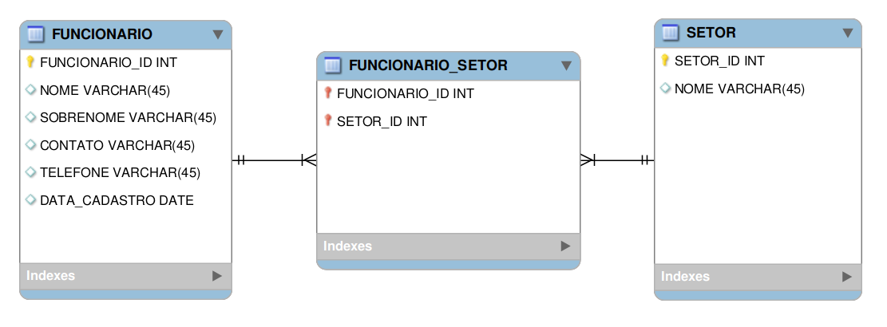

# Atividades

## Para fixar - normalização de dados

Vamos consolidar toda a explicação passada até o momento através de alguns desafios.

### 1. Normalize a tabela a seguir para a 1ª Forma Normal. Não se preocupe em montar a estrutura em código SQL neste primeiro momento. Crie apenas uma planilha (Excel, Google Sheets, Open Office Calc ou semelhantes) da estrutura esperada.

Funcionario_id | Nome | Sobrenome | Contato | Contato | DataCadastro | Setor
-------------- | ---- | --------- | ------- | -------- | ------------- | ----------
12 | Joseph | Rodrigues | jo@gmail.com | (35)998552-1445 | 2020-05-05 08:50:25 | Administração, Vendas
13 | André | Freeman | andre1990@gmail.com | (47)99522-4996 | 5 de Fevereiro de 2020 | Operacional
14 | Cíntia | Duval | cindy@outlook.com | (33)99855-4669 | 2020-05-05 10:55:35 | Estratégico, Vendas
15 | Fernanda | Mendes | fernandamendes@yahoo.com | (33)99200-1556 | 2020-05-05 11:45:40 | Marketing

**Resposta:**

Colunas devem possuir apenas um valor, então foi criada uma tabela para setores e outra intemediária para relacionar setor e funcionário (N-N).

A tabela não pode ter duas colunas com o mesmo nome, portanto, renomeei uma das colunas Contato para Telefone.

A coluna deve ter somente dados de um tipo, portanto, na coluna DataCadastro foi ajustada a data do funcionário com id 13;



* **FUNCIONARIO**

Funcionario_id | Nome | Sobrenome | Contato | Telefone | DataCadastro
-------------- | ---- | --------- | ------- | -------- | -------- 
12 | Joseph | Rodrigues | jo@gmail.com | (35)998552-1445 | 2020-05-05 08:50:25
13 | André | Freeman | andre1990@gmail.com | (47)99522-4996 | 2020-02-05 00:00:00
14 | Cíntia | Duval | cindy@outlook.com | (33)99855-4669 | 2020-05-05 10:55:35
15 | Fernanda | Mendes | fernandamendes@yahoo.com | (33)99200-1556 | 2020-05-05 11:45:40

<br>

* **SETOR**

Setor_id | Nome
---------| ----
1 | Administração
2 | Vendas
3 | Operacional
4 | Estratégico
5 | Marketing

<br>

* **FUNCIONARIO_SETOR**

Funcionario_id | Setor_id
-------------- | --------
12 | 1
12 | 2
13 | 3
14 | 4
14 | 2
15 | 5

### 2. Usando a estrutura (já normalizada para 1ª Forma Normal) da tabela anterior, transforme-a agora na 2ª Forma Normal.

A tabela resultante do exercício anterior já atende os requisitos da 2ª Forma Normal.

### 3. Monte uma query que:

* Crie um banco de dados chamado **normalization**;
* Crie todas as tabelas resultantes do exercício 2 (na 2ª Forma Normal);
* Popule todas as tabelas com os dados fornecidos nos exercícios.

```sql
DROP DATABASE IF EXISTS normalization;
CREATE DATABASE normalization;
USE normalization;

CREATE TABLE FUNCIONARIO (
  FUNCIONARIO_ID INT NOT NULL PRIMARY KEY AUTO_INCREMENT,
  NOME VARCHAR(45) NOT NULL,
  SOBRENOME VARCHAR(45) NOT NULL,
  CONTATO VARCHAR(45) NOT NULL,
  TELEFONE VARCHAR(45) NOT NULL,
  DATA_CADASTRO DATETIME DEFAULT NOW()
) AUTO_INCREMENT=12 ENGINE=InnoDB;

CREATE TABLE SETOR (
  SETOR_ID INT NOT NUll PRIMARY KEY AUTO_INCREMENT,
  NOME VARCHAR(45) NOT NULL
) ENGINE=InnoDB;

CREATE TABLE FUNCIONARIO_SETOR (
  FUNCIONARIO_ID INT NOT NULL,
  SETOR_ID INT NOT NULL,
  PRIMARY KEY (FUNCIONARIO_ID, SETOR_ID),
  FOREIGN KEY (FUNCIONARIO_ID) REFERENCES FUNCIONARIO(FUNCIONARIO_ID),
  FOREIGN KEY (SETOR_ID) REFERENCES SETOR(SETOR_ID)
) ENGINE=InnoDB;

INSERT INTO SETOR (NOME)
VALUES
  ("Administração"),
  ("Vendas"),
  ("Operacional"),
  ("Estratégico"),
  ("Marketing");

INSERT INTO FUNCIONARIO (
  NOME,
  SOBRENOME,
  CONTATO,
  TELEFONE,
  DATA_CADASTRO
) 
VALUES
  ('Joseph', 'Rodrigues', 'jo@gmail.com', '(35)998552-1445', CAST('2020-05-05 08:50:25' AS DATETIME)),
  ('André', 'Freeman', 'andre1990@gmail.com', '(47)99522-4996', CAST('2020-02-05 00:00:00' AS DATETIME)),
  ('Cíntia', 'Duval', 'cindy@outlook.com', '(33)99855-4669', CAST('2020-05-05 10:55:35' AS DATETIME)),
  ('Fernanda', 'Mendes', 'fernandamendes@yahoo.com', '(33)99200-1556', CAST('2020-05-05 11:45:40' AS DATETIME));

INSERT INTO FUNCIONARIO_SETOR (
  FUNCIONARIO_ID,
  SETOR_ID
)
VALUES
  (12, 1),
  (12, 2),
  (13, 3),
  (14, 4),
  (14, 2),
  (15, 5);
```

## Para fixar - dump

Selecione um dos bancos de dados já existentes no seu servidor local ( **w3schools**, **northwind**, **sakila**, **hr**, etc.) e faça os passos a seguir:

1. Exporte **a estrutura e os dados** (tabelas, triggers, procedures, functions e o schema ) para um dump em formato de arquivo SQL, como foi exibido nas instruções anteriores. Faça o dump através da linha de comando e usando o **MySQL Workbench**.

```bash
mysqldump -u root -p --triggers --routines --databases --add-drop-table w3schools > w3schools.sql
```

Pelo **MySQL Workbench** o dump é feito em Administration > Data Export.

2. Após ter feito isso, abra o arquivo usando algum editor de texto e altere as duas linhas iniciais, mudando o nome do banco a ser criado e do banco a ser usado. Assim seu script vai restaurar um banco novo e não sobrescrever o atual.

  * No exemplo abaixo, foi feito o backup do banco de dados **hotel**. Após ser gerado o backup, o arquivo foi aberto, e o nome do banco a ser criado foi alterado para **hotel2**. A linha `USE hotel` também foi alterada para `USE hotel2`.


```bash
sed -i -e 's/w3schools/w3schoolsClone/g' w3schools.sql
mysql -u root -p < w3schools.sql
```

3. Confira que, ao executar os comandos para restaurar o **dump**, um novo banco de dados foi criado, como na imagem abaixo.


Resultado:


